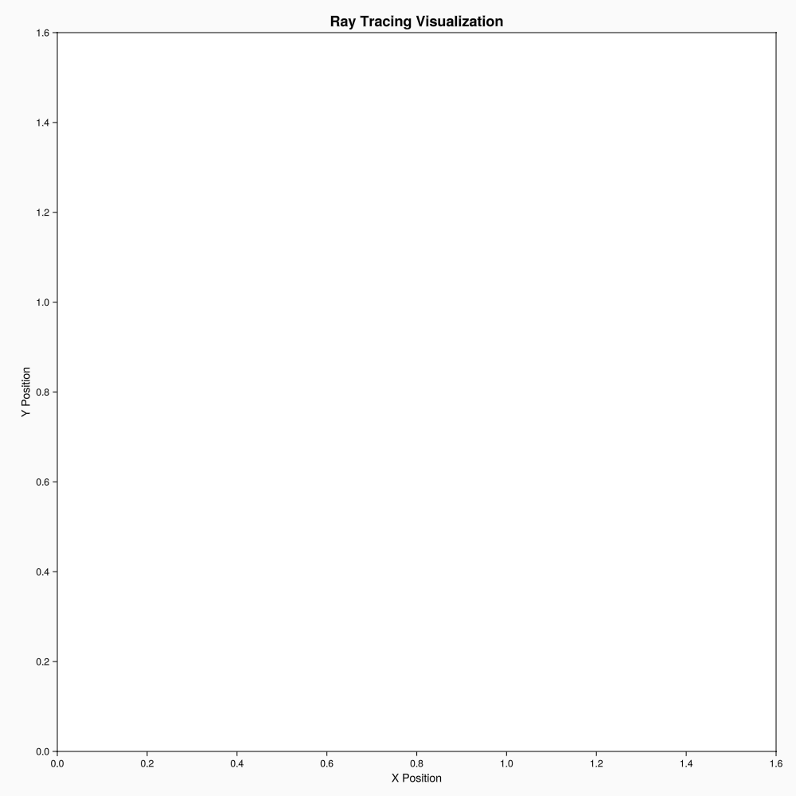
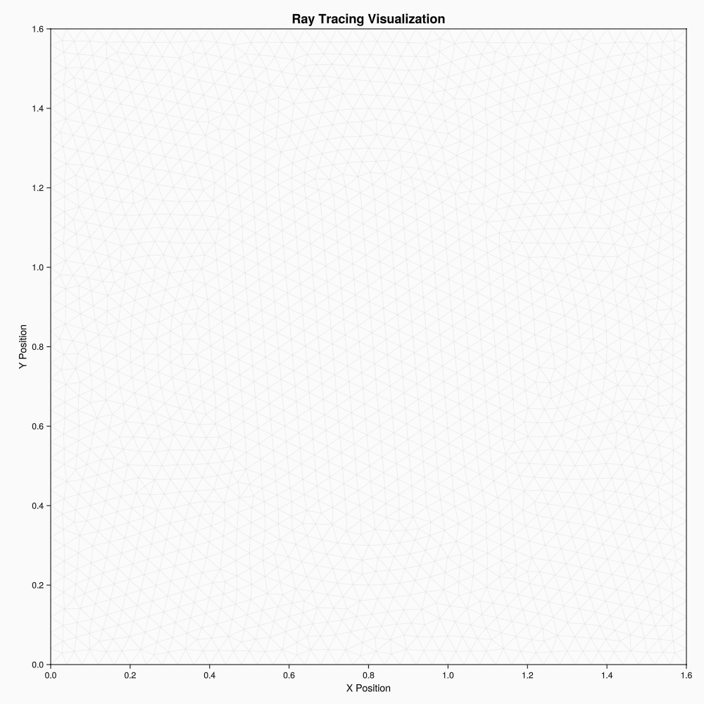

# RayTracing.jl

[](https://github.com/rvignolo/RayTracing.jl/actions)

A high-performance Julia package for ray tracing in unstructured meshes, designed for neutron transport calculations and other particle transport simulations.

## Overview

RayTracing.jl implements the **Method of Characteristics (MOC)** for solving the neutron transport equation. The partial integro-differential [neutron transport equation](https://en.wikipedia.org/wiki/Neutron_transport#Neutron_transport_equation) can be cast as an ordinary differential equation over tracks that emulate neutron trajectories across a problem domain. This library addresses the cyclic ray tracing of those paths over any 2D rectangular mesh and computes quantities used to solve the transport equation in [NeutronTransport.jl](https://github.com/rvignolo/NeutronTransport.jl).

### Key Features

- **Efficient Ray Tracing**: Fast generation of cyclic ray trajectories
- **Unstructured Mesh Support**: Works with any 2D mesh geometry
- **Multiple Boundary Conditions**: Vacuum, reflective, and periodic boundaries
- **High-Performance Visualization**: Optimized plotting recipes for large datasets
- **Transport-Ready**: Direct integration with neutron transport solvers

## Installation

The package can be installed using the Julia package manager. From the Julia REPL, type `]` to enter the `Pkg` REPL mode and run:

```julia
pkg> add RayTracing
```

Or, equivalently, via the `Pkg` API:

```julia
julia> import Pkg; Pkg.add("RayTracing")
```

## Quick Start

```julia
using RayTracing
using GridapGmsh: GmshDiscreteModel

# Load mesh and define a model
mshfile = joinpath(@__DIR__, "demo", "pincell.msh")
model = GmshDiscreteModel(mshfile; renumber=true)

# Configure ray tracing parameters
nφ = 8   # number of azimuthal angles
δ = 2e-2 # azimuthal spacing

# Initialize track generator
tg = TrackGenerator(model, nφ, δ)

# Perform ray tracing and segmentation
trace!(tg)      # Generate tracks
segmentize!(tg) # Compute segments
```

## Demo

This demo showcases the ray tracing algorithm. The first animation shows ray tracing without the mesh, while the second shows ray tracing with the mesh overlay. The mesh uses a simple pin-cell geometry, demonstrating how superposition of tracks over the mesh generates segments.

<p align="center">
    
    
</p>

## Workflow

The ray tracing process consists of two main steps:

1. **Track Tracing**: Generate ray trajectories across the domain
2. **Segmentation**: Discretize tracks into segments within mesh elements

|  |  |  |
|:-------------:|:-------------:|:-------------:|
| **Geometry / Mesh** | **Tracks** | **Segments** |

## Examples

### Basic Usage

```julia
using RayTracing
using Gridap

# Load mesh from file
model = DiscreteModelFromFile("mesh.json")

# Configure parameters
nφ = 16  # azimuthal angles
δ = 0.08 # spacing
bcs = BoundaryConditions(top=Reflective, bottom=Reflective,
                        left=Reflective, right=Reflective)

# Create and run ray tracing
tg = TrackGenerator(model, nφ, δ, bcs=bcs)
trace!(tg)
segmentize!(tg)

# Visualize results
using Plots
plot(tg.mesh, alpha=0.3, label="Mesh")
plot!(tg, label="Tracks")
```

### Boundary Conditions

```julia
# Reflective boundaries (rays bounce back)
bcs = BoundaryConditions(top=Reflective, bottom=Reflective,
                        left=Reflective, right=Reflective)

# Periodic boundaries (rays wrap around)
bcs = BoundaryConditions(top=Periodic, bottom=Periodic,
                        left=Periodic, right=Periodic)

# Vacuum boundaries (rays exit domain)
bcs = BoundaryConditions(top=Vacuum, bottom=Vacuum,
                        left=Vacuum, right=Vacuum)
```

## Advanced Features

### Custom Mesh Generation

Create a `gmsh` mesh using any available tool. Check out [GridapGmsh.jl](https://github.com/gridap/GridapGmsh.jl) for convenience. See [this example](demo/pincell-gmsh.jl) for a simple pin-cell geometry definition.

### Integration with Transport Solvers

```julia
# Access segments for transport calculations
for track in tg.tracks_by_uid
    for segment in track.segments
        # Use segment.ℓ for length
        # Use segment.element for material properties
        # Use segment.p and segment.q for coordinates
    end
end
```

## Contributing

Contributions are welcome! Please feel free to submit a Pull Request. For major changes, please open an issue first to discuss what you would like to change.

## License

This project is licensed under the MIT License - see the [LICENSE](LICENSE) file for details.

## Citation

If you use RayTracing.jl in your research, please cite:

```bibtex
@software{raytracing_jl,
  title = {RayTracing.jl: A Julia package for ray tracing in unstructured meshes},
  author = {Vignolo, Ramiro},
  year = {2024},
  url = {https://github.com/rvignolo/RayTracing.jl}
}
```
