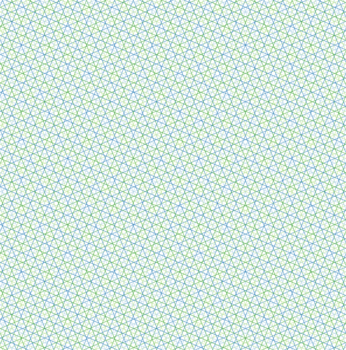
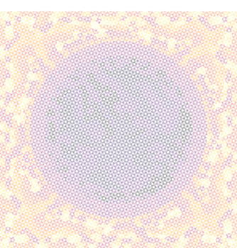

# RayTracing

[](https://github.com/rvignolo/RayTracing.jl/actions)

 The partial integro-differential [neutron transport equation](https://en.wikipedia.org/wiki/Neutron_transport#Neutron_transport_equation) can be casted to an ordinary differential equation over tracks that emulate neutron trajectories across a problem domain by means of the Method of Characteristics. This library addresses the cyclic ray tracing of those paths over any 2D rectangular mesh and computes quantities used to solve the transport equation in [NeutronTransport.jl](https://github.com/rvignolo/NeutronTransport.jl).

## Installation

The package can be installed using the Julia package manager. From the Julia REPL, type `]` to enter the `Pkg` REPL mode and run:

```julia
pkg> add RayTracing
```

Or, equivalently, via the `Pkg` API:

```julia
julia> import Pkg; Pkg.add("RayTracing")
```

 ## Example

Create a `gmsh` mesh using any available tool of your choice (checkout [GridapGmsh.jl](https://github.com/gridap/GridapGmsh.jl) for convenience). For example, [this](demo/pincell-gmsh.jl) file shows the definition of a simple *pin-cell* geometry. Then, the ray tracing consists in two steps, namely, the track tracing and the segmentation of those tracks.

```julia
using RayTracing
using GridapGmsh: GmshDiscreteModel

# load mesh and define a model with it
mshfile = joinpath(@__DIR__, "demo", "pincell.msh")
model = GmshDiscreteModel(mshfile; renumber=true)

# number of azimuthal angles
nφ = 8

# azimuthal spacing
δ = 2e-2

# initialize track generator
tg = TrackGenerator(model, nφ, δ)

# perform ray or track tracing
trace!(tg)

# proceed to segmentation
segmentize!(tg)
```

|  |  |  |
|:-------------:|:-------------:|:-------------:|
| Geometry / Mesh | Tracks | Segments |
