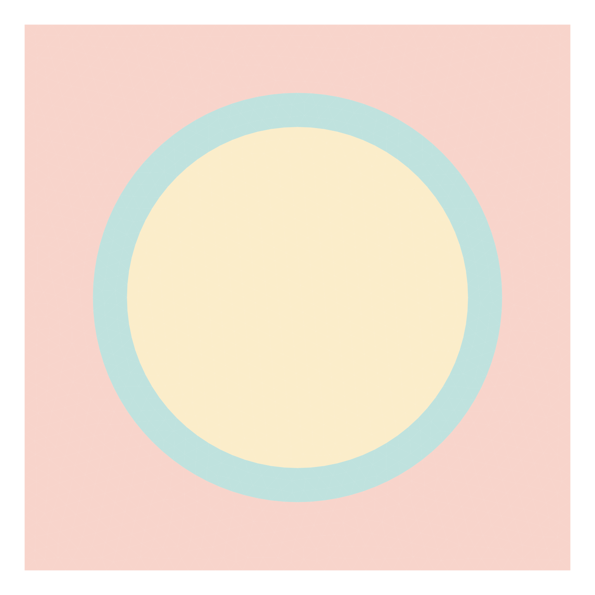
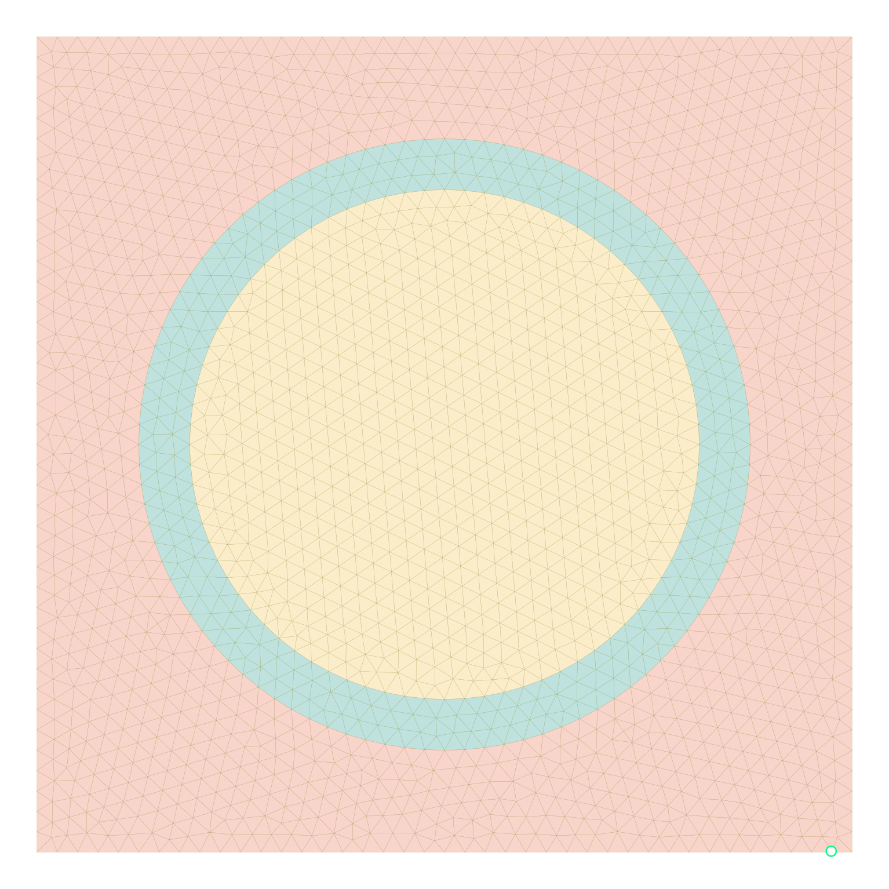
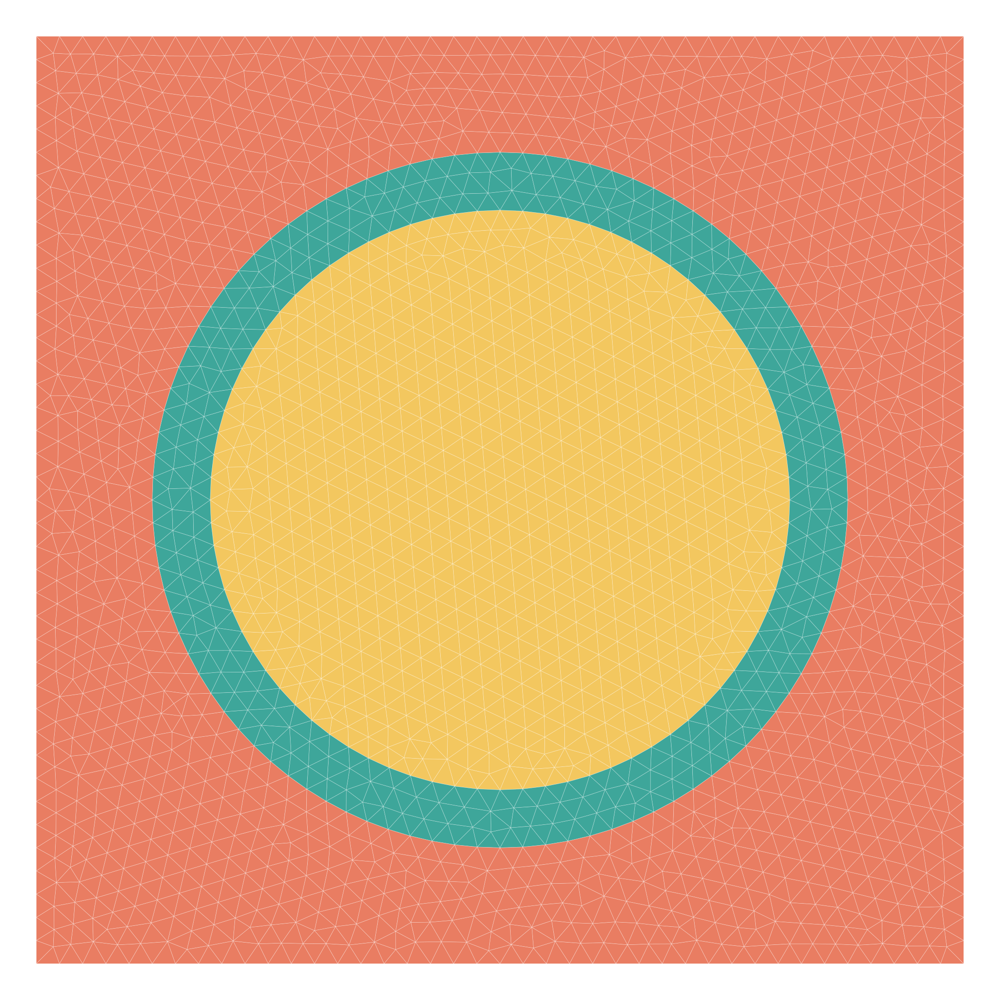
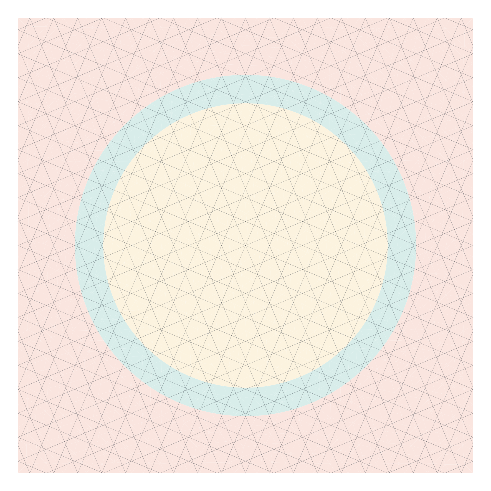
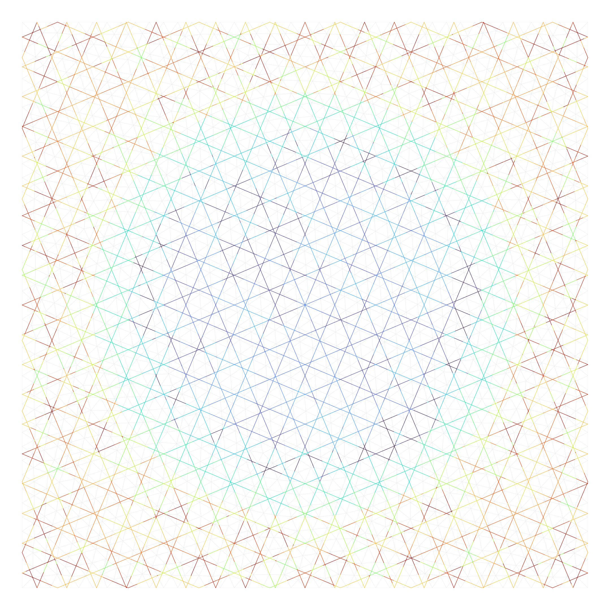

# RayTracing.jl

[](https://github.com/rvignolo/RayTracing.jl/actions)

RayTracing.jl generates two-dimensional Method of Characteristics tracks over Gridap
unstructured meshes. It builds cyclic track graphs, segments tracks by mesh cell, and
computes ray-tracing volumes for neutron transport workflows such as
[NeutronTransport.jl](https://github.com/rvignolo/NeutronTransport.jl).

<p align="center">
  
  
</p>

## Features

- Unstructured 2D Gridap meshes, including triangles and quadrilaterals.
- Vacuum, reflective, and periodic rectangular-domain boundary conditions.
- Cyclic track connectivity for forward and backward transport sweeps.
- Track segmentation by mesh element.
- Optional exact geometric volume correction.
- Lightweight Plots.jl recipes through RecipesBase.

## Installation

```julia
import Pkg
Pkg.add("RayTracing")
```

For local development:

```julia
import Pkg
Pkg.develop(path="/path/to/RayTracing.jl")
```

## Quick Start

```julia
using Gridap
using RayTracing

model = DiscreteModelFromFile("demo/pincell.json")

n_azim = 8
spacing = 0.08
bcs = reflective_boundaries()

tg = TrackGenerator(model, n_azim, spacing; bcs)
trace!(tg)
segmentize!(tg)

println(tg.n_total_tracks)
println(sum(length(track.segments) for track in tg.tracks_by_uid))
```

## Workflow

|  |  |  |
|:-------------------------:|:----------------------------:|:------------------------------:|
| Mesh and materials | Cyclic tracks | Cell-local segments |

## Boundary Conditions

```julia
vacuum_boundaries()
reflective_boundaries()
periodic_boundaries()

BoundaryConditions(
    top=Vacuum,
    bottom=Reflective,
    left=Periodic,
    right=Periodic,
)
```

## Plotting

RayTracing does not require Plots.jl for core tracking. Load Plots.jl when you want the
recipes:

```julia
using Plots

plot(tg.mesh)
plot(tg)
plot(tg.tracks_by_uid)
```

The README assets are reproducible:

```bash
julia --project=demo demo/pincell.jl
```

The mesh source can also be regenerated from gmsh in an environment that has GridapGmsh:

```bash
julia demo/pincell-gmsh.jl -nopopup
```

## Transport Integration

After `segmentize!(tg)`, each `Track` contains ordered `Segment`s with:

- `segment.p` and `segment.q`: segment endpoints.
- `segment.ℓ`: segment length.
- `segment.element`: Gridap cell id.

The full track graph is available through `tg.tracks_by_uid`, with `next_track_fwd` and
`next_track_bwd` links plus direction helpers for cyclic sweeps.

## Documentation

Build local docs with:

```bash
julia --project=docs docs/make.jl
```

## Benchmarks

The benchmark suite uses BenchmarkTools and lives in `benchmark/`:

```bash
julia --project=benchmark benchmark/runbenchmarks.jl --quick
julia --project=benchmark benchmark/runbenchmarks.jl
julia --project=benchmark benchmark/runbenchmarks.jl --output benchmark/results.json
```

Benchmark definitions are grouped in `benchmark/benchmarks.jl` so they can also be loaded by
PkgBenchmark-style workflows.

## License

RayTracing.jl is distributed under the MIT License. See [LICENSE](LICENSE).

## Citation

```bibtex
@software{raytracing_jl,
  title = {RayTracing.jl: A Julia package for ray tracing in unstructured meshes},
  author = {Vignolo, Ramiro},
  year = {2024},
  url = {https://github.com/rvignolo/RayTracing.jl}
}
```
