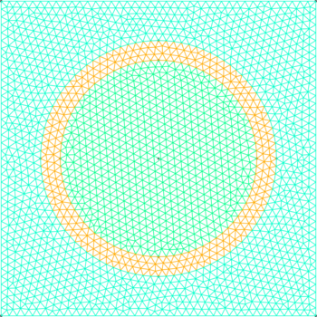

# RayTracing

[](https://github.com/rvignolo/RayTracing.jl/actions)

 The partial integro-differential [neutron transport equation](https://en.wikipedia.org/wiki/Neutron_transport#Neutron_transport_equation) can be casted to an ordinary differential equation over tracks that emulate neutron trajectories across a problem domain by means of the Method of Characteristics. This library addresses the cyclic ray tracing of those paths over any 2D rectangular mesh and computes quantities which can be used to solve the transport equation.

 ## Example

Create a `gmsh` mesh using any available tool of your choice (checkout [GridapGmsh.jl](https://github.com/gridap/GridapGmsh.jl) for convenience). For example, [this](https://github.com/rvignolo/RayTracing.jl/blob/main/demo/pincell-gmsh.jl) file shows the definition of a simple *pin-cell* geometry:



Then, define an `UnstructuredDiscreteModel`:

```julia
using GridapGmsh: GmshDiscreteModel

mshfile = joinpath(@__DIR__,"demo","pincell.msh")
model = GmshDiscreteModel(mshfile; renumber=true)
```
and perform a ray tracing over such object:
```julia
using Plots
using RayTracing

# number of azimuthal angles
nφ = 8

# azimuthal spacing
δ = 0.02

# initialize track generator
tg = TrackGenerator(model, nφ, δ)

# perform ray tracing
trace!(tg)

# plot tracks
plot(tg, dpi=300, size=(250,250), palette=:Paired_4, background_color=:transparent)
```

