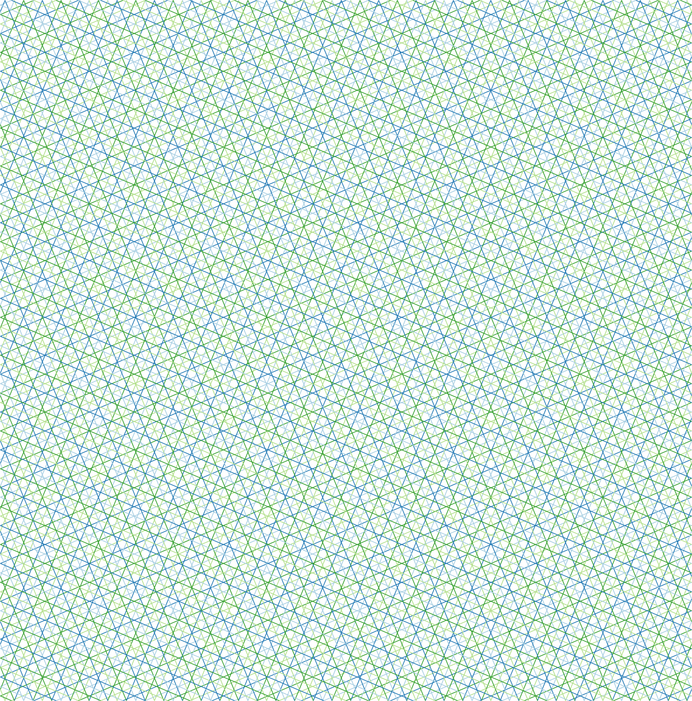

# RayTracing

[](https://github.com/rvignolo/RayTracing.jl/actions)

The Method of Characteristics can transform the partial integro-differential neutron transport equation to an ordinary differential equation over tracks that emulate neutron trajectories across a problem domain. This library adresses the cyclic ray tracing of those paths over any 2D rectangular mesh and computes quantities which can be used to solve the transport equation.

We can create a `gmsh` mesh using [GridapGmsh.jl](https://github.com/gridap/GridapGmsh.jl). For example, [this](https://github.com/rvignolo/RayTracing.jl/demo/pincell.jl) file shows the definition of a simple **pin-cell** geometry.


Then, we can define a `UnstructuredDiscreteModel`:

```julia
using GridapGmsh: GmshDiscreteModel

mshfile = joinpath(@__DIR__,"demo","pincell.msh")
model = GmshDiscreteModel(mshfile; renumber=true)
```
and perform a ray tracing over such domain:

```julia
using Plots
using RayTracing

# number of azimuthal angles
nφ = 8

# azimuthal spacing
δ = 0.04

# initialize track generator
tg = TrackGenerator(model, nφ, δ)

# perform ray tracing
trace!(tg)

# plot tracks
plot(tg, dpi=300)
```

